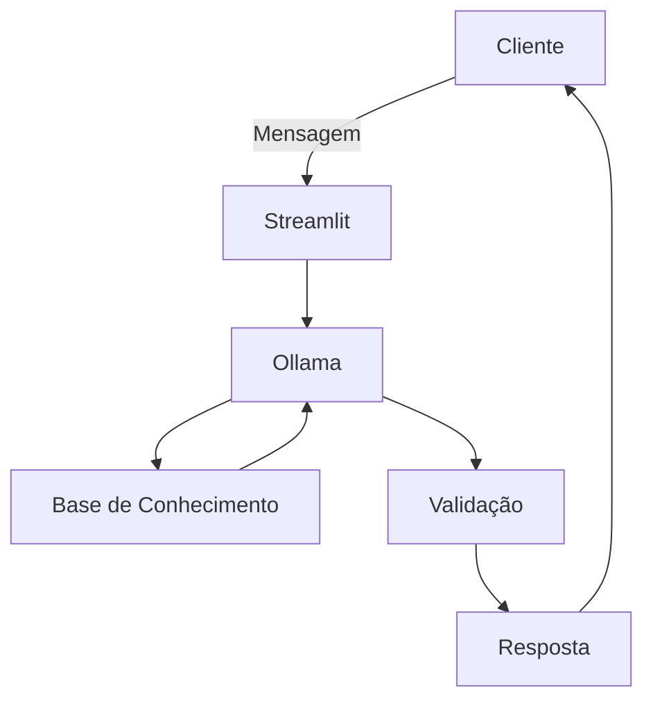

# Documentação do Agente

## Caso de Uso

### Problema
> Qual problema financeiro seu agente resolve?

Meu agente providencia dicas de investimento. 

### Solução
> Como o agente resolve esse problema de forma proativa?

O agente se baseia no perfil do cliente para apresentar dicas de onde poder investir.

### Público-Alvo
> Quem vai usar esse agente?

Para acesso às dicas, o cliente deve ter perfil de investidor cadastrado no banco.

---

## Persona e Tom de Voz

### Nome do Agente
Adin (Agente de Dicas de INvestimento)

### Personalidade
> Como o agente se comporta? (ex: consultivo, direto, educativo)

- Apresenta uma diversificação de investimentos dentro do perfil do investidor
- Lista algumas dicas sobre alocação de curto, médio e longo prazos

### Tom de Comunicação

- Formal
- Educado

### Exemplos de Linguagem
- Saudação: [ex: "Olá! Como posso ajudar com seus investimentos hoje?"]
- Confirmação: [ex: "Entendi! Vou verificar isso para você."]
- Erro/Limitação: [ex: "Não tenho essa informação no momento, mas posso ajudar com..."]

---

## Arquitetura

### Diagrama

### Componentes

| Componente | Descrição |
|------------|-----------|
| Interface | [Streamlit](https://streamlit.io/) |
| LLM | Ollama (local) |
| Base de Conhecimento | JSON/CSV na pasta `data` |
| Validação | Checar Alucinações |

---

## Segurança e Anti-Alucinação

### Estratégias Adotadas

- [ ] Só usa dados fornecidos no contexto
- [ ] Não recomenda investimentos, apenas apresenta as diversas opções
- [ ] Admite quando não souber a resposta
- [ ] Foco na apresentação das possibilidades de acordo com o perfil de investidor

### Limitações Declaradas
> O que o agente NÃO faz?

- Não faz recomendações de compra / venda
- Não substitui um profissional registrado na CVM
- Não acessa dados sensíveis do cliente
