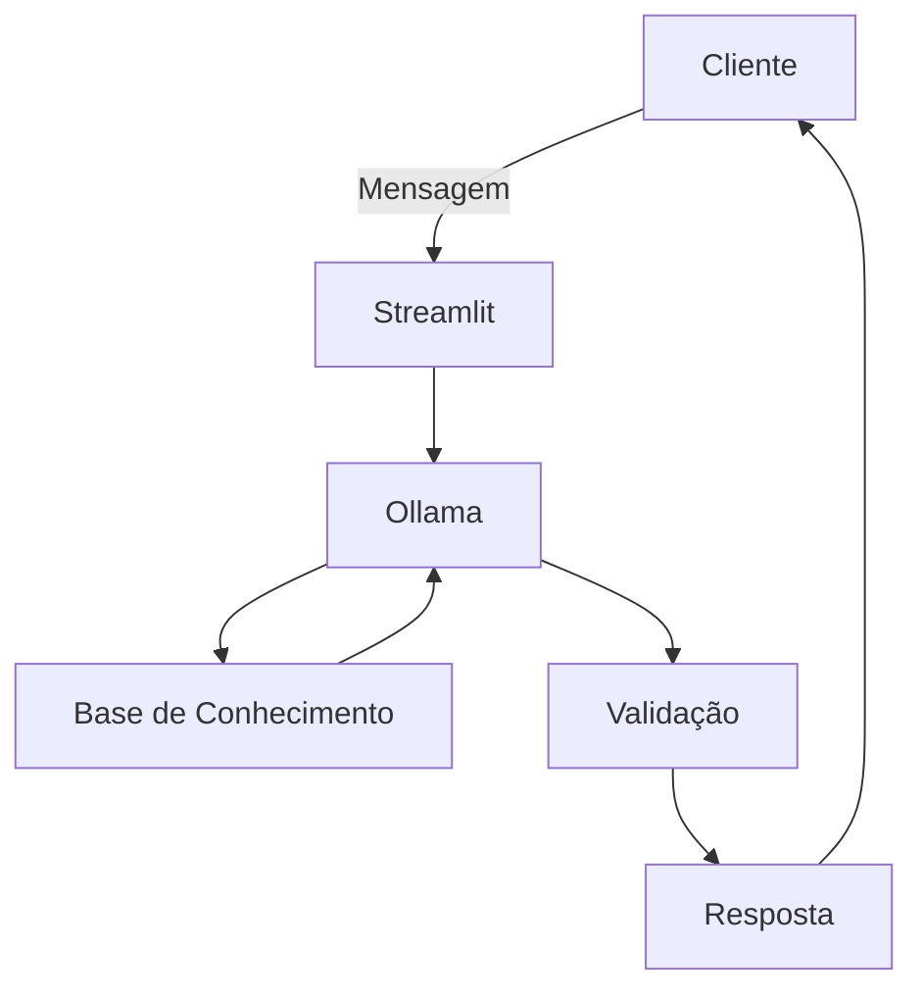

# Documentação do Agente

## Caso de Uso

### Problema
> Qual problema financeiro seu agente resolve?

Meu agente providencia dicas de investimento em ações. 

### Solução
> Como o agente resolve esse problema de forma proativa?

O agente se baseia em análises gráficas de ações que compõem o IBOVESPA.

### Público-Alvo
> Quem vai usar esse agente?

Para acesso às dicas, o cliente deve ter perfil Arrojado ou superior.

---

## Persona e Tom de Voz

### Nome do Agente
Cofidia (COnsultor FInanceiro e DIcas de Ações)

### Personalidade
> Como o agente se comporta? (ex: consultivo, direto, educativo)

- Apresenta possíveis estágios para as ações (Compra, Venda, Sobrevenda, Sobrecompra, Neutro)
- Lista algumas empresas de cada setor e o estágio em que elas se encontram na análise gráfica

### Tom de Comunicação

- Formal
- Educado

### Exemplos de Linguagem
- Saudação: [ex: "Olá! Como posso ajudar com suas ações hoje?"]
- Confirmação: [ex: "Entendi! Vou verificar isso para você."]
- Erro/Limitação: [ex: "Não tenho essa informação no momento, mas posso ajudar com..."]

---

## Arquitetura

### Diagrama

### Componentes

| Componente | Descrição |
|------------|-----------|
| Interface | [Streamlit](https://streamlit.io/) |
| LLM | Ollama (local) |
| Base de Conhecimento | JSON/CSV na pasta `data` |
| Validação | Checar Alucinações |

---

## Segurança e Anti-Alucinação

### Estratégias Adotadas

- [ ] Só usa dados fornecidos no contexto
- [ ] Não recomenda investimentos, apenas apresenta o cenário ao cliente
- [ ] Admite quando não souber a resposta
- [ ] Foco na apresentação das empresas e situação gráfica

### Limitações Declaradas
> O que o agente NÃO faz?

- Não faz recomendações de compra / venda
- Não substitui um profissional registrado na CVM
- Não acessa dados sensíveis do cliente
